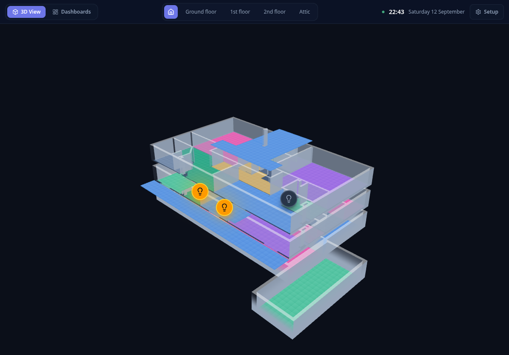
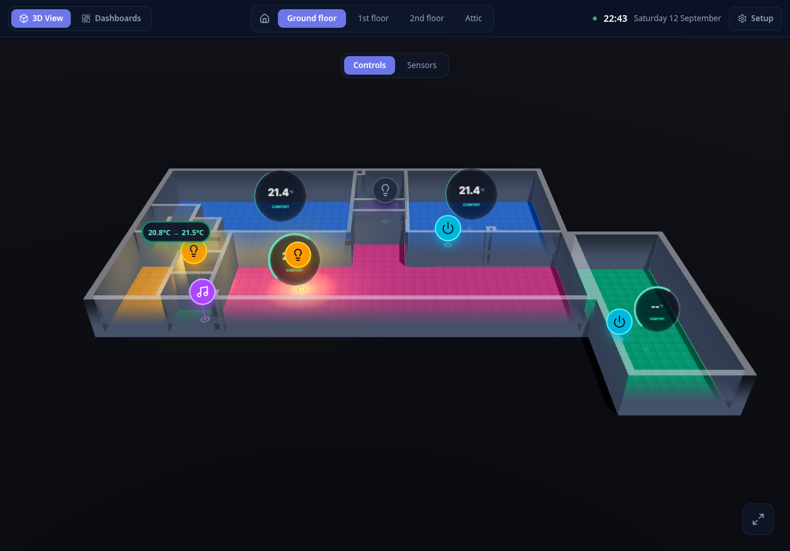
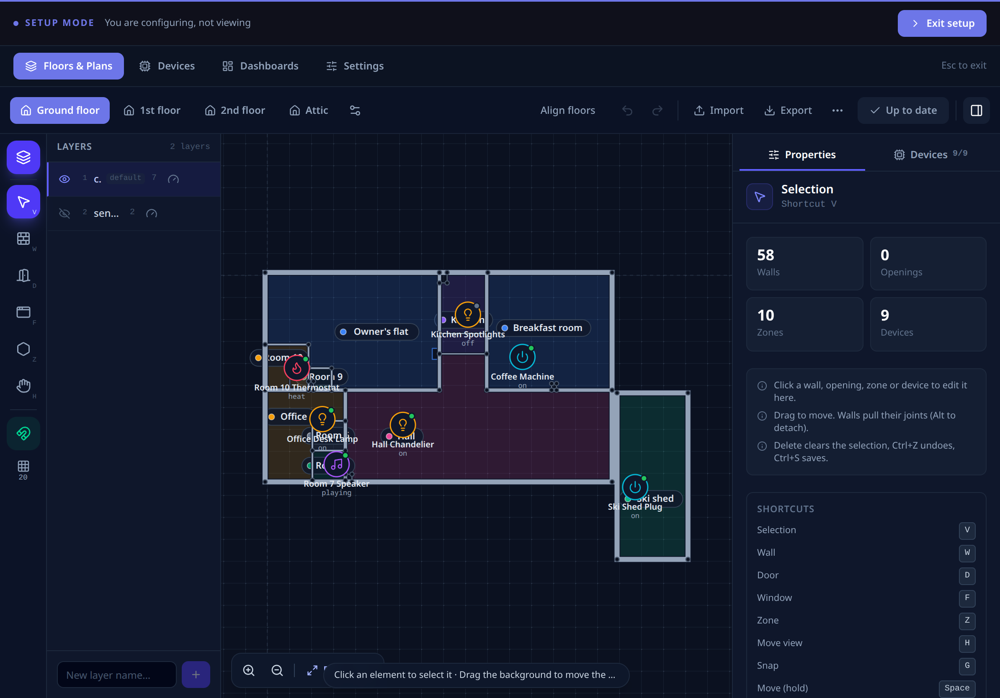
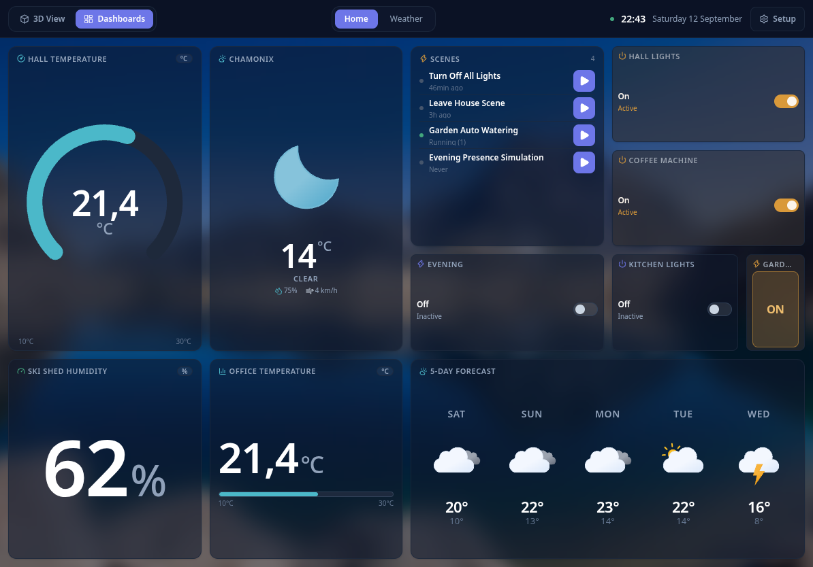

# Walldash

[](LICENSE)
[](go.mod)
[](frontend/package.json)
[](frontend/package.json)

**Walldash** brings your house to life in live 3D. The touch-first home automation dashboard for Home Assistant — zero Blender, zero YAML. Built from the ground up for a seamless, tactile experience on wall-mounted touchscreens and tablets.

📖 **[Read the user manual](https://jlugagne.github.io/walldash/)** — installation, onboarding, the 3D views and the 2D editor.

---

## 📸 Screenshots


*House overview — every level stacked into a single isometric model, with active lights glowing per room.*


*Live 3D Controls layer — tap lights, switches and appliances; active lights cast an ambient halo around their room.*


*Live 3D Sensors layer — temperature and humidity projected over each room, with comfort thresholds that pulse when crossed.*


*In-browser 2D editor — trace walls and openings, define zones across levels, and drag devices onto the plan.*


*Dashboards — a touch-friendly grid of gauges, toggles and favorite automations, composed in Setup mode.*

*Screenshots captured from the built-in demo devices and a generic example plan — no real installation is shown.*

---

## ✨ Features

- **🏠 House Overview**:
  - Every level stacked into a single isometric model, so the whole home is readable at a glance.
  - Tap a floor to open it; the stacking order follows the level order defined in the editor.

- **🎮 3D Floor View**:
  - Fixed isometric projection built with **Three.js** and **React Three Fiber**.
  - Switchable **display layers** — *Controls* (interactive devices) and *Sensors* (passive readouts) — plus custom user layers.
  - Ambient halos around active lights and ceiling status discs that surface sensor comfort in place.
  - Interactive device toggles (lights, switches, appliances) and real-time sensor readouts directly inside the 3D space.

- **✏️ 2D Plan Editor**:
  - In-browser vector editor to trace walls and openings, and define interior rooms and outdoor zones (gardens, patios).
  - Multi-level management (ground floors, upper floors, basements, outdoor areas) with reordering used by the house overview.
  - Drag-and-drop device placement with custom names, icons and per-device render domains.
  - Import existing **Sweet Home 3D** (`.sh3d`) plans in a single step.

- **📊 Dashboards & Widgets**:
  - Touch-friendly widget grid layouts for quick actions and monitoring.
  - Dedicated widgets for favorite automations, dials/gauges, toggle switches, and sensor statistics.
  - Compose layouts in Setup mode, with a per-dashboard background picture.

- **⚡ Real-Time WebSocket Synchronization**:
  - Instant bi-directional communication between Home Assistant, backend, and all connected wall panels.
  - Device states update immediately without manual page refreshes.

- **📦 Zero-Dependency Single Binary**:
  - Pure Go backend using `modernc.org/sqlite` (no CGO required).
  - Frontend assets compiled and embedded directly into the Go binary (`embed.FS`).
  - Home Assistant base image with s6-overlay: the same image runs standalone and as an official-style add-on.

---

## 🚀 Quick Start

### As a Home Assistant Add-on (Recommended)

1. Add the add-on repository to Home Assistant: **Settings** → **Add-ons** → **Add-on Store** → menu (⋮) → **Repositories**, then add `https://github.com/JLugagne/ha-addons`.
2. Install **Walldash** from the store and start it. No Home Assistant API token setup is required: the add-on connects through the Supervisor API automatically.
3. Reach the Walldash web UI on your wall tablets **over HTTPS** (terminate TLS in a reverse proxy in front of the add-on, see [`docs/reverse-proxy.md`](docs/reverse-proxy.md)). Plain HTTP cannot hold the authentication cookies.
4. Enroll the first device with the one-time code from the add-on log (see [Device authentication](#-device-authentication-otp)). Data is stored in the add-on `/data` volume and survives updates and reboots.

See [`docs/home-assistant-add-on.md`](docs/home-assistant-add-on.md) for packaging details, add-on options, and the release process.

### Using Docker Compose (Alternative)

1. Clone the repository:
   ```bash
   git clone https://github.com/JLugagne/walldash.git
   cd walldash
   ```

2. Create your `.env` file from the example:
   ```bash
   cp .env.example .env
   ```

3. Fill in your Home Assistant details in `.env`:
   ```env
   HA_URL=http://homeassistant.local:8123
   HA_TOKEN=your_long_lived_access_token_here
   PORT=8080
   DB_PATH=/app/data/walldash.db
   ```

4. Launch with Docker Compose:
   ```bash
   docker compose up -d
   ```

5. Open your browser or tablet display at `http://<server-ip>:9090` (the Compose file maps host port `9090` to the container's `8080`). For sign-in to work, serve it over HTTPS (put a TLS reverse proxy in front); plain HTTP cannot hold the authentication cookies.

> No Home Assistant configured yet? Walldash starts in **demo mode** with built-in example devices, so you can explore the interface before connecting a real instance.

---

## 🔑 Home Assistant Setup

Walldash communicates with Home Assistant through its REST API and WebSocket events.

To generate a Long-Lived Access Token:
1. Open your Home Assistant web interface.
2. Click on your user profile icon (bottom left).
3. Scroll down to the **Security** tab > **Long-Lived Access Tokens**.
4. Click **Create Token**, give it a name (e.g., `Walldash`), and copy the generated token into your `.env` file.

---

## 🔐 Device Authentication (OTP)

Walldash authenticates each screen itself — tablets never log in with a Home Assistant account.
Every device is its own anonymous Walldash account with its own subject UUID, which keeps wall
panels usable in kiosk mode (no Home Assistant session, no long-lived HA token on the device)
while still letting you decide which screens may change the dashboard.

### Why a one-time code

There is no password to share and nothing to provision in Home Assistant. Instead a device
proves it belongs to this Walldash instance by entering a short-lived, single-use one-time code
(OTP) that an operator reads from the server side. The API never returns the code, so a device
cannot simply enroll itself.

### Enrollment flow

1. A device with no auth cookie calls `POST /api/auth/connect`. Walldash creates a **pending**
   device account bound to that device and issues an OTP valid for **15 minutes**.
2. The code is delivered where an operator can read it — never in the HTTP response:
   - written to the container/add-on log as `otp_issued` (the JSON field is `code`); this is the
     intended channel and the only one available for the very first device;
   - listed in **Setup → Access** once an `owner` or `admin` device exists.
3. The user types the code into the app, which calls `POST /api/auth/verify`. On success
   Walldash promotes the pending device to a real account and sets two cookies:
   - an **access token** — 15 minutes;
   - a **refresh token** — 60 days, rotated on every refresh.
4. The first device ever to verify becomes **owner**; every later device becomes **device**.

### Roles

| Role | Can do |
| --- | --- |
| `owner` | The first enrolled device. Everything an `admin` can do, plus grant/remove the `owner` role, promote/demote `admin`, and revoke any device. |
| `admin` | Manage devices (promote to `admin`, demote to `device`), revoke devices, and read pending enrollment codes. |
| `device` | Use the dashboard only; no Setup access. |

Only an `owner` may grant or remove the `owner` role, so an `admin` cannot escalate itself.

### Sessions and revocation

Tokens are cookies, so nothing has to be stored on the device. The access cookie lasts 15
minutes and the refresh cookie lasts 60 days and rotates on every `POST /api/auth/refresh`;
the account's existence and status are re-checked on each rotation.

**Revocation is bounded, not instant.** Revoking a device deletes its refresh tokens
immediately, so it can never refresh again, but an access token already issued stays valid until
it expires — up to 15 minutes (there is no deny-list, by design).
`POST /api/auth/logout` revokes only the current device's refresh family and clears its cookies;
the account itself stays active.

### HTTPS is mandatory

Authentication cookies are named with the `__Host-` prefix and always set `Secure`. Browsers
silently drop such cookies over plain HTTP, which surfaces as a login loop with no visible error.
Always serve Walldash over HTTPS — terminate TLS in a reverse proxy in front of the
container/add-on (see [`docs/reverse-proxy.md`](docs/reverse-proxy.md)). The proxy must forward
`X-Forwarded-Proto: https` so Walldash knows the client connection is secure.

### Custom domain and origins

If the reverse proxy rewrites the `Host` header (the forward host differs from the name in the
browser), tell Walldash the public hostname:

- `DOMAIN=walldash.domain.tld` (or the add-on `domain` option) — accepts a bare host,
  `http://host` or `https://host`; an optional port is kept and any path/query is ignored.
- `ALLOWED_ORIGINS` (or the add-on `allowed_origins` option) — extra comma-separated origins;
  accepts a full URL or a bare host. Merged with `DOMAIN`.

These feed the CORS `Access-Control-Allow-Origin` header, the CSRF/same-origin checks and the
refresh/logout origin check. If the proxy preserves `Host` (the common case, for example NPM's
default), no extra configuration is needed.

### WebSocket

`/api/ws` (live device state) also requires a valid **access** cookie. When it expires the client
refreshes over HTTP and reconnects; the socket handshake cannot refresh on its own. A revoked
device therefore stops receiving live updates within at most 15 minutes, like any other
protected call.

### First-device bootstrap

Before any authenticated device exists there is no **Setup → Access** yet, so read the very first
`otp_issued` code from the container/add-on log and enter it on the first tablet. That device
becomes `owner`.

---

## ⚙️ Configuration Reference

Settings resolve with the following precedence: **environment variable** → **add-on options file** (`/data/options.json`) → **default**.

| Variable | Default | Description |
| --- | --- | --- |
| `PORT` | `8080` | HTTP port the server listens on. |
| `DB_PATH` | `walldash.db` (or `/data/walldash.db` when the `/data` volume exists) | SQLite database path. |
| `HA_URL` | `http://homeassistant.local:8123` | Home Assistant base URL. |
| `HA_TOKEN` | _(empty)_ | Long-lived access token. Not needed when running as an add-on: `SUPERVISOR_TOKEN` is used automatically via the Supervisor API proxy. The Supervisor token is never attached to a custom `HA_URL`. |
| `TOKEN_SECRET` | _(auto-generated + persisted)_ | HS256 key used to sign access/refresh tokens, at least 32 bytes. Leave empty to generate one on first boot and persist it in the database; keep it stable, changing it invalidates all sessions. |
| `LOG_LEVEL` | `info` | Log level: `debug`, `info`, `warn`, `error`. |
| `ALLOWED_ORIGINS` | _(empty)_ | Comma-separated trusted origins for CORS, CSRF and the same-origin check, needed when a reverse proxy rewrites the `Host` header. Accepts `https://host` or a bare `host`. Also settable as the add-on option `allowed_origins`. |
| `DOMAIN` | _(empty)_ | Public hostname of this Walldash instance, used for the CORS `Access-Control-Allow-Origin` header and the CSRF/same-origin checks. Accepts a bare host, `http://host` or `https://host`; an optional port is kept and any path/query is ignored. Merged with `ALLOWED_ORIGINS`. Also settable as the add-on option `domain`. |
| `FRONTEND_DIR` | _(embedded assets)_ | Serve the frontend from a directory instead of the embedded build. |

---

## 🌐 Custom Domain (Reverse Proxy)

To reach Walldash at `https://walldash.domain.tld` with automatic HTTPS, see
[`docs/reverse-proxy.md`](docs/reverse-proxy.md) (Nginx Proxy Manager setup,
works for both Docker Compose and the add-on — WebSocket support required).

Set `DOMAIN=walldash.domain.tld` (or the add-on `domain` option) so the CORS header and the
CSRF/same-origin checks trust the public hostname. This is needed when the reverse proxy rewrites
the `Host` header; extra origins can still be listed in `ALLOWED_ORIGINS`.

---

## 🏗️ Architecture & Tech Stack

```
walldash/
├── cmd/             # Application entrypoint (+ add-on runtime helpers)
├── rootfs/          # s6-overlay service definitions for the add-on image
├── internal/
│   └── dashboard/   # Hexagonal architecture (Domain, App, Inbound, Outbound)
│       ├── domain/  # Core business models, interfaces, domain errors
│       ├── app/     # Application logic & use-cases
│       ├── inbound/ # HTTP handlers (Gorilla Mux), WebSocket hub, CSRF protection
│       └── outbound/# Adapters for SQLite and Home Assistant API
├── pkg/dashboard/   # Public API contracts and DTO types
└── frontend/        # React 19 SPA (Vite, TypeScript, Three.js, React Three Fiber, Tailwind CSS v4)
```

- **Backend**: Go (Go 1.26+), Hexagonal / Clean Architecture, Gorilla Mux, Gorilla WebSocket, modernc SQLite, Logrus.
- **Frontend**: React 19, TypeScript, Three.js, React Three Fiber, Drei, Tailwind CSS v4, Lucide React, Vitest.

---

## 🛠️ Local Development

### Prerequisites
- [Go](https://go.dev/) (1.26+)
- [Node.js](https://nodejs.org/) (22+) and `npm`

### 1. Run the Frontend (Dev server with HMR)
```bash
cd frontend
npm install
npm run dev
```

### 2. Run the Backend
```bash
# From repository root
go run ./cmd/main.go
```

### 3. Run Tests

**Backend tests:**
```bash
go test -race -failfast ./...
```

**Frontend tests:**
```bash
cd frontend
npm test
```

---

## 📄 License

This project is licensed under the MIT License - see the [LICENSE](LICENSE) file for details.
